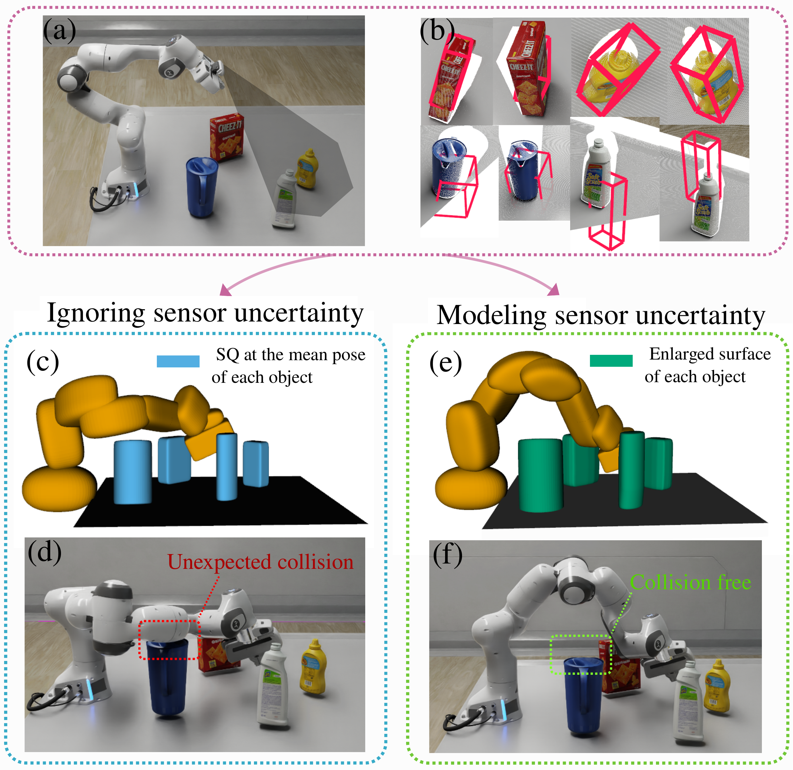

[Xiaoli Wang1](https://github.com/lily983){:target="_blank"}, [Sipu Ruan1](https://ruansp.github.io/){:target="_blank"}, [Xin Meng1](https://github.com/XinnMeng){:target="_blank"}, 
[Hongtao Wu1](https://github.com/ChirikjianLab){:target="_blank"},
[Wanze Li1](https://github.com/ChirikjianLab){:target="_blank"},
[Zhanhong Sun1](https://github.com/ChirikjianLab){:target="_blank"},
[Yuwei Wu1](https://github.com/ChirikjianLab){:target="_blank"},
[Ceng Zhang1](https://github.com/ChirikjianLab){:target="_blank"},
[Wan Su1](https://github.com/ChirikjianLab){:target="_blank"}, [Gregory Chirikjian1*](https://cde.nus.edu.sg/me/staff/chirikjian-gregory-s/){:target="_blank"}

1Department of Mechanical Engineering, National University of Singapore, Singapore

*Department of Mechanical Engineering, University of Delaware, USA

## Motivation
This website presents the research outcomes of our group to demonstrate progress toward our funded project goal: using physical simulation to detect and reason about the affordances of objects.

Our central concept is affordance imagination — enabling robots to mentally simulate possible interactions with previously unseen objects. By integrating physics-based reasoning, geometric analysis, and learning methods (from demonstrations and large language models), our robots can classify novel objects, predict functional poses, and execute manipulation strategies without relying on massive amounts of training data.

The works presented here illustrate how affordance imagination bridges the gap between theory and practice: from seating a teddy bear on a previously unseen chair, to predicting hanging poses of tools, to capping containers, to leveraging LLMs for task decomposition. Together, these efforts chart a path toward safe, generalizable, and intelligent robot interaction in household and healthcare environments.

## Affordance Imagination
- [Paper](https://arxiv.org/abs/2502.15525){:target="_blank"}
- Code: 
  - C++ library & ROS package: upcoming..
  - [MATLAB implementation](https://github.com/lily983/pcd-matlab){:target="_blank"}: MATLAB version for algorithms. It also includes visualizaions for figures in the paper and benchmark results from C++ implementations.

## Introductory Figure
<figure>
  
  <figcaption><em>Figure 1: Comparison of motion planning results with and without taking into account sensing uncertainty. (a-b) Pose estimates of each object using an existing method in Isaac Sim. (c) Superquadric representation of each robot link at its ground truth pose (yellow) and of each object at its estimated mean pose (blue), where the robot configuration is justified as valid by a deterministic collision checker. (d) Snapshot of a collision between the robot and an object due to unmodeled pose uncertainty. (e) The enlarged surface that encapsulates many rotated copies of the objects due to orientation errors in pose estimates (green), and the robot configuration that is justified as valid by our probabilistic collision checker. (f) Corresponding snapshot of the robot showing no collision with objects.</em></figcaption>
</figure>

