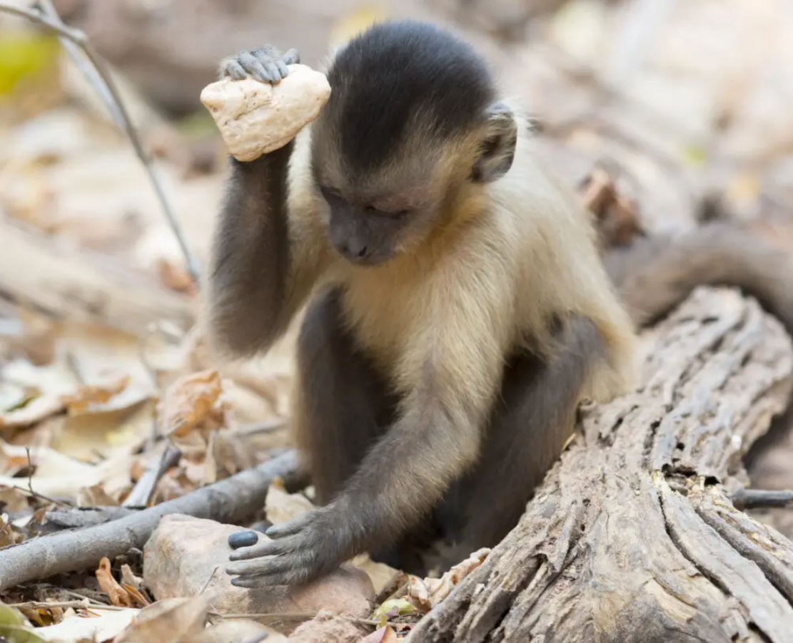
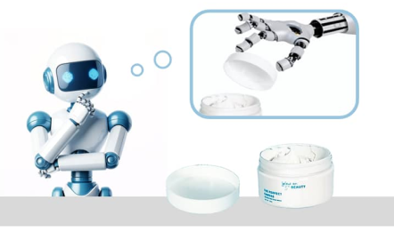
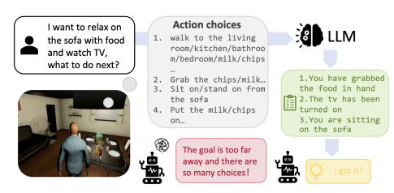
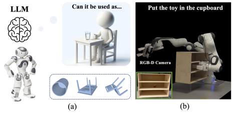
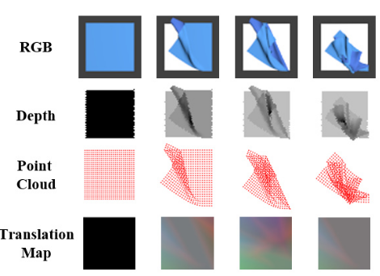
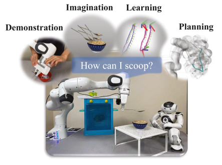
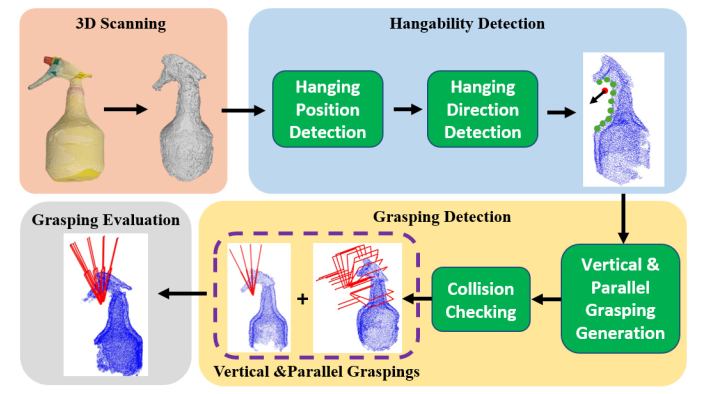
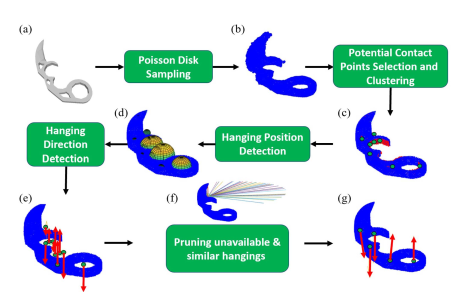
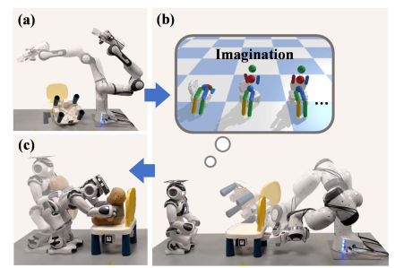
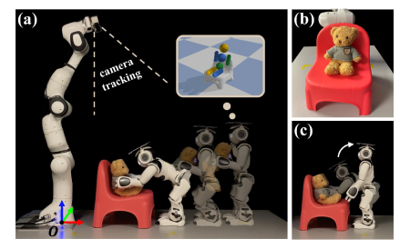

[Xiaoli Wang1](https://github.com/lily983){:target="_blank"}, [Sipu Ruan1](https://ruansp.github.io/){:target="_blank"}, [Xin Meng1](https://github.com/XinnMeng){:target="_blank"}, 
[Hongtao Wu1](https://github.com/ChirikjianLab){:target="_blank"},
[Wanze Li1](https://github.com/ChirikjianLab){:target="_blank"},
[Zhanhong Sun1](https://github.com/ChirikjianLab){:target="_blank"},
[Yuwei Wu1](https://github.com/ChirikjianLab){:target="_blank"},
[Ceng Zhang1](https://github.com/ChirikjianLab){:target="_blank"},
[Wan Su1](https://github.com/ChirikjianLab){:target="_blank"}, 
[Chen Dong2](https://github.com/ChirikjianLab){:target="_blank"}, 
[Cecilia Laschi12*](https://scholar.google.com/citations?user=1vR7lMUAAAAJ&hl=en){:target="_blank"}
[Gregory Chirikjian12*](https://cde.nus.edu.sg/me/staff/chirikjian-gregory-s/){:target="_blank"}

1Department of Mechanical Engineering, National University of Singapore, Singapore

2Department of Mechanical Engineering, University of Delaware, USA

*Principal Investigator

## Motivation: Learning Affordances Through Play
Just like this monkey experimenting with stones, humans learn to use tools by playing, testing, and discovering their affordances. A stick can become a lever, a rock can become a hammer — but this is not taught directly. Instead, it emerges through interaction and imagination.

This project takes inspiration from this natural process. Our goal is to enable robots to:

- Imagine possible uses of unfamiliar objects, much like humans and animals.

- Simulate physical interactions in a virtual environment before acting in the real world.

- Discover affordances — the actionable possibilities an object provides — without needing massive labeled datasets.

This biological analogy underpins our concept of Affordance Imagination: giving robots the ability to reason about function through simulation and exploration, the same way evolution equipped primates and humans with the ability to learn tools by trying them out.

  <figure style="margin: 0;">
    
  </figure>
  <figure style="margin: 0;">
    
  </figure>

## Introduction
This website presents the research outcomes of our group to demonstrate progress toward our funded project goal: using physical simulation to detect and reason about the affordances of objects.

Our central concept is affordance imagination — enabling robots to mentally simulate possible interactions with previously unseen objects. By integrating physics-based reasoning, geometric analysis, and learning methods (from demonstrations and large language models), our robots can classify novel objects, predict functional poses, and execute manipulation strategies without relying on massive amounts of training data.

The works presented here illustrate how affordance imagination bridges the gap between theory and practice: from seating a teddy bear on a previously unseen chair, to predicting hanging poses of tools, to capping containers, to leveraging LLMs for task decomposition. Together, these efforts chart a path toward safe, generalizable, and intelligent robot interaction in household and healthcare environments.

## Object Affordance Dictionary

This section is designed as a compact catalog for common household objects that can support affordance reasoning, simulation, and demonstration. Each entry records the object category, the 3D asset link, the main affordance, the dominant interaction pattern, and the corresponding demonstration video.

  <strong>Current asset mapping.</strong> The repository contains household object meshes under <code>assets/models/</code> in <code>.obj</code> and <code>.glb</code> format, affordance reasoning profiles under <code>assets/profiles/</code>, and demonstration videos under <code>assets/videos/</code>. Click a model path to open the 3D viewer or click <code>analysis.txt</code> to read the corresponding reasoning.

  

    <table class="dictionary-table">
      <thead>
        <tr>
          <th style="width: 4rem;">ID</th>
          <th style="width: 10rem;">Object Name</th>
          <th style="width: 15rem;">3D Model</th>
          <th style="width: 18rem;">Primary Affordance</th>
          <th style="width: 14rem;">Affordance Reasoning</th>
          <th style="width: 20rem;">Interaction Pattern</th>
          <th style="width: 16rem;">Video</th>
        </tr>
      </thead>
      <tbody>
      <tr><td>01</td><td>Ashtray</td><td><a class="model-link" href="#" data-model="assets/models/ashtray.glb" data-name="Ashtray"><code>assets/models/ashtray.glb</code></a> <small>Click to view 3D model</small></td><td>Collect ash and small discarded items</td><td><a class="reasoning-link" href="#" data-analysis="assets/profiles/ashtray/analysis.txt" data-name="Ashtray"><code>analysis.txt</code></a> <small>Click to read reasoning</small></td><td>grasp-rimplace-on-surfacedrop-into</td><td><a class="video-link" href="#" data-video="assets/videos/ashtray.mp4" data-name="Ashtray"><code>assets/videos/ashtray.mp4</code></a> <small>Click to open video</small></td></tr>
      <tr><td>02</td><td>Basin</td><td><a class="model-link" href="#" data-model="assets/models/basin.glb" data-name="Basin"><code>assets/models/basin.glb</code></a> <small>Click to view 3D model</small></td><td>Contain water or loose objects</td><td><a class="reasoning-link" href="#" data-analysis="assets/profiles/basin/analysis.txt" data-name="Basin"><code>analysis.txt</code></a> <small>Click to read reasoning</small></td><td>grasp-rimcarryfill/pour</td><td><a class="video-link" href="#" data-video="assets/videos/basin.mp4" data-name="Basin"><code>assets/videos/basin.mp4</code></a> <small>Click to open video</small></td></tr>
      <tr><td>03</td><td>Basket</td><td><a class="model-link" href="#" data-model="assets/models/basket.obj" data-name="Basket"><code>assets/models/basket.obj</code></a> <small>Click to view 3D model</small></td><td>Store and transport household items</td><td><a class="reasoning-link" href="#" data-analysis="assets/profiles/basket/analysis.txt" data-name="Basket"><code>analysis.txt</code></a> <small>Click to read reasoning</small></td><td>grasp-handlecarryload/unload</td><td><a class="video-link" href="#" data-video="assets/videos/basket.mp4" data-name="Basket"><code>assets/videos/basket.mp4</code></a> <small>Click to open video</small></td></tr>
      <tr><td>04</td><td>Bathtub</td><td><a class="model-link" href="#" data-model="assets/models/bathtub.glb" data-name="Bathtub"><code>assets/models/bathtub.glb</code></a> <small>Click to view 3D model</small></td><td>Contain a body for washing or soaking</td><td><a class="reasoning-link" href="#" data-analysis="assets/profiles/bathtub/analysis.txt" data-name="Bathtub"><code>analysis.txt</code></a> <small>Click to read reasoning</small></td><td>approachstep-insupport-body</td><td><a class="video-link" href="#" data-video="assets/videos/bathtub.mp4" data-name="Bathtub"><code>assets/videos/bathtub.mp4</code></a> <small>Click to open video</small></td></tr>
      <tr><td>05</td><td>Bed</td><td><a class="model-link" href="#" data-model="assets/models/bed.glb" data-name="Bed"><code>assets/models/bed.glb</code></a> <small>Click to view 3D model</small></td><td>Support lying, resting, and sleeping</td><td><a class="reasoning-link" href="#" data-analysis="assets/profiles/bed/analysis.txt" data-name="Bed"><code>analysis.txt</code></a> <small>Click to read reasoning</small></td><td>approachsit/liereposition-bedding</td><td><a class="video-link" href="#" data-video="assets/videos/bed.mp4" data-name="Bed"><code>assets/videos/bed.mp4</code></a> <small>Click to open video</small></td></tr>
      <tr><td>06</td><td>Bottle</td><td><a class="model-link" href="#" data-model="assets/models/bottle.glb" data-name="Bottle"><code>assets/models/bottle.glb</code></a> <small>Click to view 3D model</small></td><td>Store and pour liquid</td><td><a class="reasoning-link" href="#" data-analysis="assets/profiles/bottle/analysis.txt" data-name="Bottle"><code>analysis.txt</code></a> <small>Click to read reasoning</small></td><td>wrap-grasptilt-pourset-down</td><td><a class="video-link" href="#" data-video="assets/videos/bottle.mp4" data-name="Bottle"><code>assets/videos/bottle.mp4</code></a> <small>Click to open video</small></td></tr>
      <tr><td>07</td><td>Bowl</td><td><a class="model-link" href="#" data-model="assets/models/bowl.glb" data-name="Bowl"><code>assets/models/bowl.glb</code></a> <small>Click to view 3D model</small></td><td>Contain food or small items</td><td><a class="reasoning-link" href="#" data-analysis="assets/profiles/bowl/analysis.txt" data-name="Bowl"><code>analysis.txt</code></a> <small>Click to read reasoning</small></td><td>grasp-rimcarryplace</td><td><a class="video-link" href="#" data-video="assets/videos/bowl.mp4" data-name="Bowl"><code>assets/videos/bowl.mp4</code></a> <small>Click to open video</small></td></tr>
      <tr><td>08</td><td>Box</td><td><a class="model-link" href="#" data-model="assets/models/box.glb" data-name="Box"><code>assets/models/box.glb</code></a> <small>Click to view 3D model</small></td><td>Enclose, store, and organize contents</td><td><a class="reasoning-link" href="#" data-analysis="assets/profiles/box/analysis.txt" data-name="Box"><code>analysis.txt</code></a> <small>Click to read reasoning</small></td><td>grasp-sideopen/closepack</td><td><a class="video-link" href="#" data-video="assets/videos/box.mp4" data-name="Box"><code>assets/videos/box.mp4</code></a> <small>Click to open video</small></td></tr>
      <tr><td>09</td><td>Chair</td><td><a class="model-link" href="#" data-model="assets/models/chair.glb" data-name="Chair"><code>assets/models/chair.glb</code></a> <small>Click to view 3D model</small></td><td>Support sitting posture</td><td><a class="reasoning-link" href="#" data-analysis="assets/profiles/chair/analysis.txt" data-name="Chair"><code>analysis.txt</code></a> <small>Click to read reasoning</small></td><td>grasp-backrestpull/pushsit-support</td><td><a class="video-link" href="#" data-video="assets/videos/chair.mp4" data-name="Chair"><code>assets/videos/chair.mp4</code></a> <small>Click to open video</small></td></tr>
      <tr><td>10</td><td>Cubby</td><td><a class="model-link" href="#" data-model="assets/models/cubby.glb" data-name="Cubby"><code>assets/models/cubby.glb</code></a> <small>Click to view 3D model</small></td><td>Compartmentalize and store objects</td><td><a class="reasoning-link" href="#" data-analysis="assets/profiles/cubby/analysis.txt" data-name="Cubby"><code>analysis.txt</code></a> <small>Click to read reasoning</small></td><td>insertretrieveorganize</td><td><a class="video-link" href="#" data-video="assets/videos/cubby.mp4" data-name="Cubby"><code>assets/videos/cubby.mp4</code></a> <small>Click to open video</small></td></tr>
      <tr><td>11</td><td>Cup</td><td><a class="model-link" href="#" data-model="assets/models/cup.glb" data-name="Cup"><code>assets/models/cup.glb</code></a> <small>Click to view 3D model</small></td><td>Contain and transport a drink</td><td><a class="reasoning-link" href="#" data-analysis="assets/profiles/cup/analysis.txt" data-name="Cup"><code>analysis.txt</code></a> <small>Click to read reasoning</small></td><td>grasp-sideliftdrink/pour</td><td><a class="video-link" href="#" data-video="assets/videos/cup.mp4" data-name="Cup"><code>assets/videos/cup.mp4</code></a> <small>Click to open video</small></td></tr>
      <tr><td>12</td><td>Cupboard</td><td><a class="model-link" href="#" data-model="assets/models/cupboard.glb" data-name="Cupboard"><code>assets/models/cupboard.glb</code></a> <small>Click to view 3D model</small></td><td>Store protected household items</td><td><a class="reasoning-link" href="#" data-analysis="assets/profiles/cupboard/analysis.txt" data-name="Cupboard"><code>analysis.txt</code></a> <small>Click to read reasoning</small></td><td>open-doorshelveclose-door</td><td><a class="video-link" href="#" data-video="assets/videos/cupboard.mp4" data-name="Cupboard"><code>assets/videos/cupboard.mp4</code></a> <small>Click to open video</small></td></tr>
      <tr><td>13</td><td>Display Stand</td><td><a class="model-link" href="#" data-model="assets/models/display.glb" data-name="Display Stand"><code>assets/models/display.glb</code></a> <small>Click to view 3D model</small></td><td>Present and support an object visibly</td><td><a class="reasoning-link" href="#" data-analysis="assets/profiles/display/analysis.txt" data-name="Display Stand"><code>analysis.txt</code></a> <small>Click to read reasoning</small></td><td>place-objectstabilizereposition</td><td><a class="video-link" href="#" data-video="assets/videos/display.mp4" data-name="Display Stand"><code>assets/videos/display.mp4</code></a> <small>Click to open video</small></td></tr>
      <tr><td>14</td><td>Ladle</td><td><a class="model-link" href="#" data-model="assets/models/ladle.glb" data-name="Ladle"><code>assets/models/ladle.glb</code></a> <small>Click to view 3D model</small></td><td>Scoop and transfer liquid</td><td><a class="reasoning-link" href="#" data-analysis="assets/profiles/ladle/analysis.txt" data-name="Ladle"><code>analysis.txt</code></a> <small>Click to read reasoning</small></td><td>grasp-handledippour-out</td><td><a class="video-link" href="#" data-video="assets/videos/ladle.mp4" data-name="Ladle"><code>assets/videos/ladle.mp4</code></a> <small>Click to open video</small></td></tr>
      <tr><td>15</td><td>Plate</td><td><a class="model-link" href="#" data-model="assets/models/plate.glb" data-name="Plate"><code>assets/models/plate.glb</code></a> <small>Click to view 3D model</small></td><td>Support and present food</td><td><a class="reasoning-link" href="#" data-analysis="assets/profiles/plate/analysis.txt" data-name="Plate"><code>analysis.txt</code></a> <small>Click to read reasoning</small></td><td>pinch-edgecarry-flatset-down</td><td><a class="video-link" href="#" data-video="assets/videos/plate.mp4" data-name="Plate"><code>assets/videos/plate.mp4</code></a> <small>Click to open video</small></td></tr>
      <tr><td>16</td><td>Pot</td><td><a class="model-link" href="#" data-model="assets/models/pot.glb" data-name="Pot"><code>assets/models/pot.glb</code></a> <small>Click to view 3D model</small></td><td>Contain and heat ingredients</td><td><a class="reasoning-link" href="#" data-analysis="assets/profiles/pot/analysis.txt" data-name="Pot"><code>analysis.txt</code></a> <small>Click to read reasoning</small></td><td>grasp-handleliftpour</td><td><a class="video-link" href="#" data-video="assets/videos/pot.mp4" data-name="Pot"><code>assets/videos/pot.mp4</code></a> <small>Click to open video</small></td></tr>
      <tr><td>17</td><td>Riser</td><td><a class="model-link" href="#" data-model="assets/models/riser.glb" data-name="Riser"><code>assets/models/riser.glb</code></a> <small>Click to view 3D model</small></td><td>Raise an object to a higher level</td><td><a class="reasoning-link" href="#" data-analysis="assets/profiles/riser/analysis.txt" data-name="Riser"><code>analysis.txt</code></a> <small>Click to read reasoning</small></td><td>place-underelevatestabilize</td><td><a class="video-link" href="#" data-video="assets/videos/riser.mp4" data-name="Riser"><code>assets/videos/riser.mp4</code></a> <small>Click to open video</small></td></tr>
      <tr><td>18</td><td>Shelf</td><td><a class="model-link" href="#" data-model="assets/models/shelf.glb" data-name="Shelf"><code>assets/models/shelf.glb</code></a> <small>Click to view 3D model</small></td><td>Support stored objects vertically</td><td><a class="reasoning-link" href="#" data-analysis="assets/profiles/shelf/analysis.txt" data-name="Shelf"><code>analysis.txt</code></a> <small>Click to read reasoning</small></td><td>place-objectstackretrieve</td><td><a class="video-link" href="#" data-video="assets/videos/shelf.mp4" data-name="Shelf"><code>assets/videos/shelf.mp4</code></a> <small>Click to open video</small></td></tr>
      <tr><td>19</td><td>Shoe Rack</td><td><a class="model-link" href="#" data-model="assets/models/shoe_rack.glb" data-name="Shoe Rack"><code>assets/models/shoe_rack.glb</code></a> <small>Click to view 3D model</small></td><td>Organize and store footwear</td><td><a class="reasoning-link" href="#" data-analysis="assets/profiles/shoe_rack/analysis.txt" data-name="Shoe Rack"><code>analysis.txt</code></a> <small>Click to read reasoning</small></td><td>place-pairalignretrieve</td><td><a class="video-link" href="#" data-video="assets/videos/shoe_rack.mp4" data-name="Shoe Rack"><code>assets/videos/shoe_rack.mp4</code></a> <small>Click to open video</small></td></tr>
      <tr><td>20</td><td>Stool</td><td><a class="model-link" href="#" data-model="assets/models/stool.glb" data-name="Stool"><code>assets/models/stool.glb</code></a> <small>Click to view 3D model</small></td><td>Support sitting or standing reach</td><td><a class="reasoning-link" href="#" data-analysis="assets/profiles/stool/analysis.txt" data-name="Stool"><code>analysis.txt</code></a> <small>Click to read reasoning</small></td><td>top-grasprepositionstep/sit</td><td><a class="video-link" href="#" data-video="assets/videos/stool.mp4" data-name="Stool"><code>assets/videos/stool.mp4</code></a> <small>Click to open video</small></td></tr>
      <tr><td>21</td><td>Table</td><td><a class="model-link" href="#" data-model="assets/models/table.glb" data-name="Table"><code>assets/models/table.glb</code></a> <small>Click to view 3D model</small></td><td>Support placement and workspace use</td><td><a class="reasoning-link" href="#" data-analysis="assets/profiles/table/analysis.txt" data-name="Table"><code>analysis.txt</code></a> <small>Click to read reasoning</small></td><td>place-objectlean-supportpush</td><td><a class="video-link" href="#" data-video="assets/videos/table.mp4" data-name="Table"><code>assets/videos/table.mp4</code></a> <small>Click to open video</small></td></tr>
      <tr><td>22</td><td>Trash Bin</td><td><a class="model-link" href="#" data-model="assets/models/trashbin.glb" data-name="Trash Bin"><code>assets/models/trashbin.glb</code></a> <small>Click to view 3D model</small></td><td>Receive and contain waste</td><td><a class="reasoning-link" href="#" data-analysis="assets/profiles/trashbin/analysis.txt" data-name="Trash Bin"><code>analysis.txt</code></a> <small>Click to read reasoning</small></td><td>drop-intograsp-rimrelocate</td><td><a class="video-link" href="#" data-video="assets/videos/trashbin.mp4" data-name="Trash Bin"><code>assets/videos/trashbin.mp4</code></a> <small>Click to open video</small></td></tr>
      <tr><td>23</td><td>TV Stand</td><td><a class="model-link" href="#" data-model="assets/models/tv_stand.obj" data-name="TV Stand"><code>assets/models/tv_stand.obj</code></a> <small>Click to view 3D model</small></td><td>Support media devices at viewing height</td><td><a class="reasoning-link" href="#" data-analysis="assets/profiles/tv_stand/analysis.txt" data-name="TV Stand"><code>analysis.txt</code></a> <small>Click to read reasoning</small></td><td>place-objectorganize-cablesreposition</td><td><a class="video-link" href="#" data-video="assets/videos/tv_stand.mp4" data-name="TV Stand"><code>assets/videos/tv_stand.mp4</code></a> <small>Click to open video</small></td></tr>
      <tr><td>24</td><td>Vase</td><td><a class="model-link" href="#" data-model="assets/models/vase.obj" data-name="Vase"><code>assets/models/vase.obj</code></a> <small>Click to view 3D model</small></td><td>Hold flowers or decorative stems</td><td><a class="reasoning-link" href="#" data-analysis="assets/profiles/vase/analysis.txt" data-name="Vase"><code>analysis.txt</code></a> <small>Click to read reasoning</small></td><td>grasp-bodyinsert-stemsplace-display</td><td><a class="video-link" href="#" data-video="assets/videos/vase.mp4" data-name="Vase"><code>assets/videos/vase.mp4</code></a> <small>Click to open video</small></td></tr>
      <tr><td>25</td><td>Wine Glass</td><td><a class="model-link" href="#" data-model="assets/models/wine_glass.obj" data-name="Wine Glass"><code>assets/models/wine_glass.obj</code></a> <small>Click to view 3D model</small></td><td>Contain and present a beverage delicately</td><td><a class="reasoning-link" href="#" data-analysis="assets/profiles/wine_glass/analysis.txt" data-name="Wine Glass"><code>analysis.txt</code></a> <small>Click to read reasoning</small></td><td>pinch-stemliftsip/place</td><td><a class="video-link" href="#" data-video="assets/videos/wine_glass.mp4" data-name="Wine Glass"><code>assets/videos/wine_glass.mp4</code></a> <small>Click to open video</small></td></tr>
      </tbody>
    </table>
  

  

    

      

        <strong id="model-modal-title">3D Model Viewer</strong>
        <code id="model-modal-path">assets/example</code>
        <small>Drag to rotate. Scroll to zoom. Right-drag to pan.</small>
      

      <button class="model-modal-close" id="model-modal-close" type="button">Close</button>
    

    

      
Loading viewer...

      <canvas class="model-viewer-canvas" id="model-viewer-canvas"></canvas>
    

  

  

    

      

        <strong id="reasoning-modal-title">Affordance Reasoning</strong>
        <code id="reasoning-modal-path">assets/profiles/example/analysis.txt</code>
        <small>Click outside the window or press Escape to close.</small>
      

      <button class="model-modal-close" id="reasoning-modal-close" type="button">Close</button>
    

    

      <pre class="reasoning-content" id="reasoning-content">Loading analysis...</pre>
    

  

  

    

      

        <strong id="video-modal-title">Object Video</strong>
        <code id="video-modal-path">assets/videos/example.mp4</code>
        <small>Play the video in the current page.</small>
      

      <button class="model-modal-close" id="video-modal-close" type="button">Close</button>
    

    

      <video class="video-player" id="video-player" controls preload="metadata"></video>
    

  

This table now reflects the actual contents of your `assets` folder. Click any model link to open a centered in-page viewer. When you add videos, replace each placeholder path with a local file, a linked thumbnail, or an embedded player.

## Related Works

### Put a Lid on It! A Learning-Free Method to Cap a Container via Physical Simulations (UR 2025)

 <figure style="margin: 0; margin-right: 20px;">  </figure> 
 Develops a simulation-based method for matching unseen containers and lids. Uses Gaussian process distance fields and matching imagination to achieve over 91% success rate. <a href="https://github.com/ChirikjianLab" target="_blank">Code</a>. 
 

### Goal-Guided Reinforcement Learning: Leveraging Large Language Models for Long-Horizon Task Decomposition (ICRA 2025)

 <figure style="margin: 0; margin-right: 20px;">  </figure> 
 Proposes G2RL, where LLMs generate subgoals to help reinforcement learning explore efficiently in long-horizon tasks. Validated across simulated environments with improved convergence. <a href="https://github.com/ChirikjianLab" target="_blank">Code</a>. 
 

### RAIL: Robot Affordance Imagination with Large Language Models (ISER 2025)

 <figure style="margin: 0; margin-right: 20px;">  </figure> 
 Combines LLMs with physics-based simulation for automatic affordance reasoning. From minimal semantic input, robots classify novel objects, predict functional poses, and perform unseen tasks. <a href="https://github.com/ChirikjianLab" target="_blank">Code</a>. 
 

### RaggeDi: Diffusion-based State Estimation of Disordered Rags, Sheets, Towels and Blankets (arXiv 2024)

 <figure style="margin: 0; margin-right: 20px;">  </figure> 
 Applies diffusion models for cloth state estimation. Represents cloth deformation as a translation map and achieves superior accuracy in both simulation and real-world experiments. <a href="https://github.com/ChirikjianLab" target="_blank">Code</a>. 
 

### PRIMP: PRobabilistically-Informed Motion Primitives for Efficient Affordance Learning from Demonstration (T-RO 2024)

 <figure style="margin: 0; margin-right: 20px;">  </figure> 
 Introduces PRIMP, which learns probabilistic motion primitives from demonstrations and integrates them with workspace-aware motion planning (Workspace-STOMP). Demonstrated on tool-use and affordance-based tasks. <a href="https://github.com/ChirikjianLab" target="_blank">Code</a>. 
 

### Grasping by Hanging: A Learning-Free Grasping Detection Method for Previously Unseen Objects (arXiv 2024)

 <figure style="margin: 0; margin-right: 20px;">  </figure> 
 Introduces Grasping-by-Hanging (GbH), a learning-free approach where robots detect hangable structures to derive grasping poses. Particularly effective for thin or flat objects. <a href="https://github.com/ChirikjianLab" target="_blank">Code</a>. 
 

### I Get the Hang of It! A Learning-Free Method to Predict Hanging Poses for Previously Unseen Objects (RA-L 2024)

 <figure style="margin: 0; margin-right: 20px;">  </figure> 
 Proposes a learning-free framework for predicting stable hanging poses using geometric and mechanical analysis. Outperforms learning-based baselines in simulation and real-world tests. <a href="https://github.com/ChirikjianLab" target="_blank">Code</a>. 
 

### Prepare the Chair for the Bear! Robot Imagination of Sitting Affordance to Reorient Previously Unseen Chairs (RA-L 2023)

  <figure style="margin: 0; margin-right: 20px;">
    
  </figure>
  

    Robots reconstruct previously unseen chairs, simulate their sitting affordance, 
    and reorient them so a humanoid agent (teddy bear proxy) can be seated. 
    Demonstrates object classification and functional pose prediction via 
    physics-based imagination. <a href="https://github.com/ChirikjianLab" target="_blank">Code</a>.
  

### Put the Bear on the Chair! Intelligent Robot Interaction with Previously Unseen Chairs via Robot Imagination (arXiv 2022)

 <figure style="margin: 0; margin-right: 20px;">  </figure> 
 Extends chair affordance reasoning by enabling a humanoid robot to physically seat a teddy bear. Introduces a human-assistance module to adjust inaccessible chair poses via natural language instructions. <a href="https://github.com/ChirikjianLab" target="_blank">Code</a>. 
 

