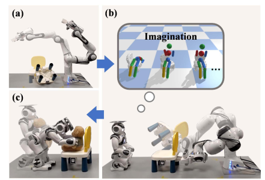

[Xiaoli Wang1](https://github.com/lily983){:target="_blank"}, [Sipu Ruan1](https://ruansp.github.io/){:target="_blank"}, [Xin Meng1](https://github.com/XinnMeng){:target="_blank"}, 
[Hongtao Wu1](https://github.com/ChirikjianLab){:target="_blank"},
[Wanze Li1](https://github.com/ChirikjianLab){:target="_blank"},
[Zhanhong Sun1](https://github.com/ChirikjianLab){:target="_blank"},
[Yuwei Wu1](https://github.com/ChirikjianLab){:target="_blank"},
[Ceng Zhang1](https://github.com/ChirikjianLab){:target="_blank"},
[Wan Su1](https://github.com/ChirikjianLab){:target="_blank"}, 
[Chen Dong2](https://github.com/ChirikjianLab){:target="_blank"}, 
[Cecilia Laschi12*](https://scholar.google.com/citations?user=1vR7lMUAAAAJ&hl=en){:target="_blank"}
[Gregory Chirikjian12*](https://cde.nus.edu.sg/me/staff/chirikjian-gregory-s/){:target="_blank"}

1Department of Mechanical Engineering, National University of Singapore, Singapore

2Department of Mechanical Engineering, University of Delaware, USA

*Principal Investigator

## Motivation: Learning Affordances Through Play
Just like this monkey experimenting with stones, humans learn to use tools by playing, testing, and discovering their affordances. A stick can become a lever, a rock can become a hammer — but this is not taught directly. Instead, it emerges through interaction and imagination.

This project takes inspiration from this natural process. Our goal is to enable robots to:

- Imagine possible uses of unfamiliar objects, much like humans and animals.

- Simulate physical interactions in a virtual environment before acting in the real world.

- Discover affordances — the actionable possibilities an object provides — without needing massive labeled datasets.

This biological analogy underpins our concept of Affordance Imagination: giving robots the ability to reason about function through simulation and exploration, the same way evolution equipped primates and humans with the ability to learn tools by trying them out.
<figure style="text-align: center;">
  
</figure>

## Introduction
This website presents the research outcomes of our group to demonstrate progress toward our funded project goal: using physical simulation to detect and reason about the affordances of objects.

Our central concept is affordance imagination — enabling robots to mentally simulate possible interactions with previously unseen objects. By integrating physics-based reasoning, geometric analysis, and learning methods (from demonstrations and large language models), our robots can classify novel objects, predict functional poses, and execute manipulation strategies without relying on massive amounts of training data.

The works presented here illustrate how affordance imagination bridges the gap between theory and practice: from seating a teddy bear on a previously unseen chair, to predicting hanging poses of tools, to capping containers, to leveraging LLMs for task decomposition. Together, these efforts chart a path toward safe, generalizable, and intelligent robot interaction in household and healthcare environments.

## Affordance Imagination

### Prepare the Chair for the Bear! Robot Imagination of Sitting Affordance to Reorient Previously Unseen Chairs (RA-L 2023)

Robots reconstruct previously unseen chairs, simulate their sitting affordance, and reorient them so a humanoid agent (teddy bear proxy) can be seated. Demonstrates object classification and functional pose prediction via physics-based imagination

<figure style="text-align: center;">
  
</figure>

  <figure style="margin: 0; margin-right: 20px;">
    
  </figure>
  

    Robots reconstruct previously unseen chairs, simulate their sitting affordance, 
    and reorient them so a humanoid agent (teddy bear proxy) can be seated. 
    Demonstrates object classification and functional pose prediction via 
    physics-based imagination. 
    
    - [Paper](https://arxiv.org/abs/2502.15525){:target="_blank"}
    - [Code](https://github.com/ChirikjianLab){:target="_blank"}
  

- [Paper](https://arxiv.org/abs/2502.15525){:target="_blank"}
- [Code](https://github.com/ChirikjianLab){:target="_blank"}

